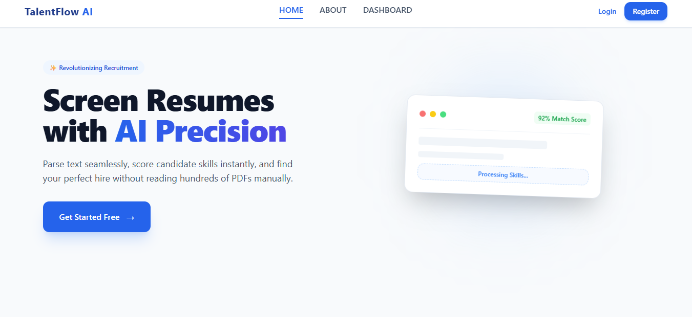
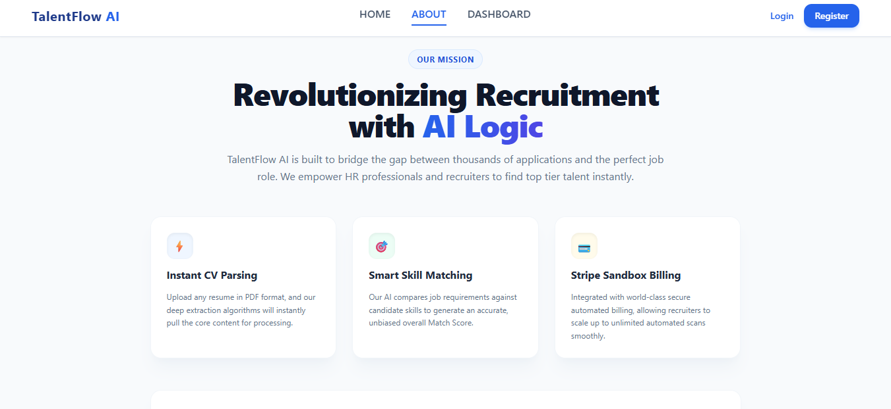
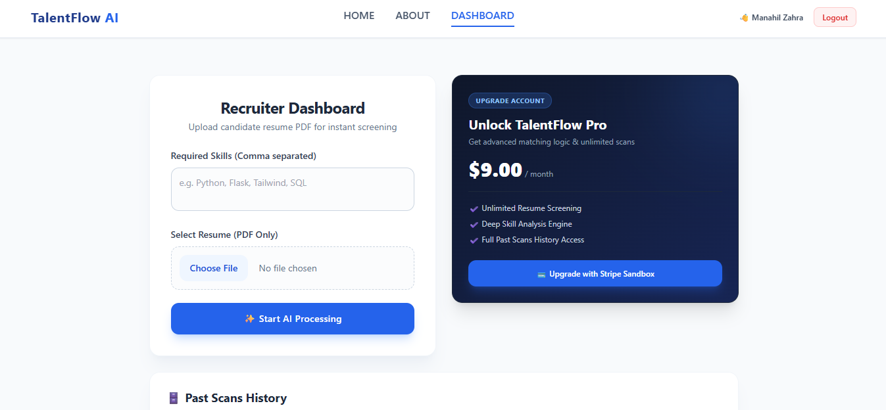
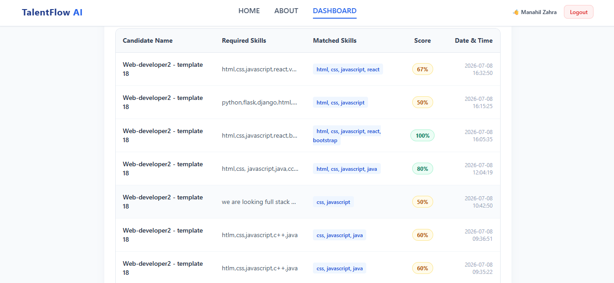
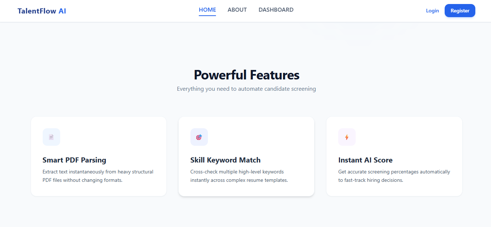
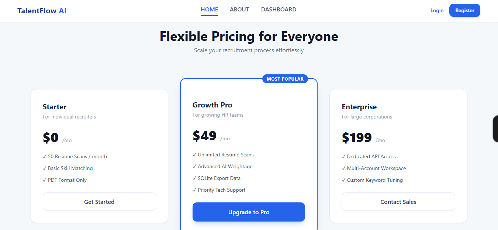
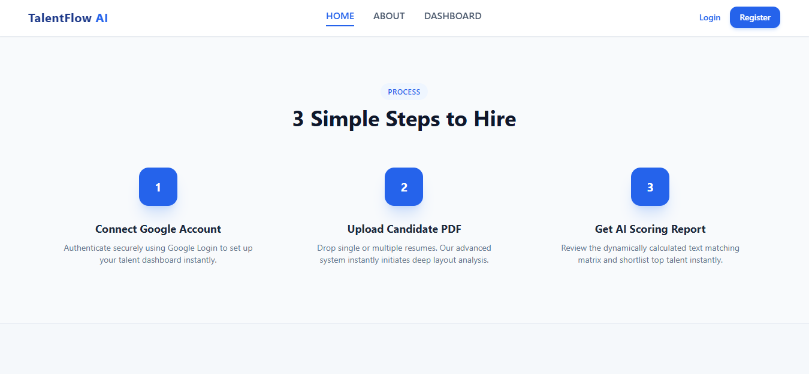

# 🚀 TalentFlow AI

An AI-powered Resume Screening and Skill Matching Web Application built with **Flask**, **Python**, and **MySQL**.

TalentFlow AI helps recruiters and HR professionals quickly analyze resumes, compare them with required skills, and calculate a matching score automatically.

---

# ✨ Features

* 🔐 Google OAuth Login
* 📄 PDF Resume Upload
* 🤖 AI-based Resume Parsing
* 🎯 Skill Matching
* 📊 Match Score Calculation
* 🗂 Resume Scan History
* 💳 Stripe Premium Integration (Sandbox)
* 🛢 MySQL Database Support
* 🎨 Responsive User Interface

---

# 🛠 Tech Stack

### Frontend

* HTML5
* CSS3
* JavaScript
* Bootstrap

### Backend

* Python
* Flask

### Database

* MySQL

### APIs & Libraries

* Google OAuth
* Stripe API
* PyPDF
* Flask-MySQLdb

---

# 📸 Screenshots

## Home Page



---

## About Page



---

## Dashboard



---

## Resume Matching Result



---

## Features Section



---

## Pricing Section



---

## Simple Steps



---

# 🎥 Demo Video

A complete walkthrough of the project is available inside the repository.

📁 **screenshots/Talent_Flow_AI_demo.mp4**

---

# 🚀 Installation

Clone the repository

```bash
git clone https://github.com/manahilzahra-dev/TalentFlow-AI.git
```

Move into the project

```bash
cd TalentFlow-AI
```

Install dependencies

```bash
pip install -r requirements.txt
```

Create a **.env** file and configure:

* SECRET_KEY
* GOOGLE_CLIENT_ID
* GOOGLE_CLIENT_SECRET
* STRIPE_SECRET_KEY
* STRIPE_PUBLISHABLE_KEY
* MYSQL_HOST
* MYSQL_USER
* MYSQL_PASSWORD
* MYSQL_DB

Run the application

```bash
python app.py
```

---

# 📂 Project Structure

```text
TalentFlow-AI/

├── app.py
├── requirements.txt
├── static/
├── templates/
├── screenshots/
├── uploads/
├── .gitignore
└── README.md
```

---

# 💡 Future Improvements

* Resume Ranking
* AI Resume Suggestions
* Multiple Resume Comparison
* Email Notifications
* Admin Dashboard
* Resume Download Reports

---

# 👩‍💻 Author

**Manahil Zahra**

GitHub

https://github.com/manahilzahra-dev

---

⭐ If you like this project, don't forget to give it a star.
